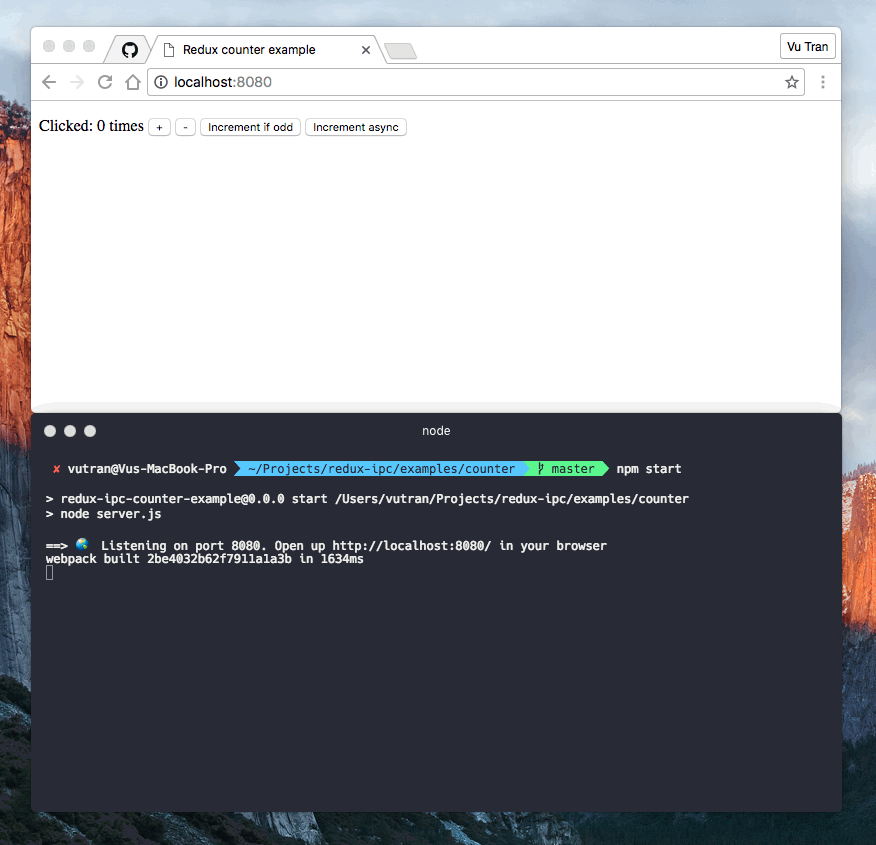

# redux-ipc
[](LICENSE)


> Log your Redux state and actions to a node backend via WebSockets.

## Install

```bash
$ npm install --save redux-ipc
```



## Usage

Apply the middleware when creating your Redux store.

```js
const reduxIpcMiddleware = require('redux-ipc');

const state = {
  todos: [],
};

// apply the middleware
const store = createStore(state, {}, applyMiddleware(reduxIpcMiddleware));

// dispatch actions
// store.dispatch(...);
// store.dispatch(...);
// store.dispatch(...);
```

Create the server to listen for messages.

```js
const Server = require('redux-ipc').Server;

const PORT = process.env.REDUX_IPC_PORT || 8080;
const PROTOCOL = process.env.REDUX_IPC_PROTOCOL || 'redux-ipc';

// create a new redux ipc server
const wss = new Server({ port: PORT, socketName: PROTOCOL });

// listen to messages
wss.on('message', message => {
  console.log(message);
});
```

## Examples

Run `npm install` and `npm start` for each directory in `/examples`.

*Note: Examples are based on the official Redux examples with slight modifications to showcase the IPC functionality.*

## License

MIT © Vu Tran
